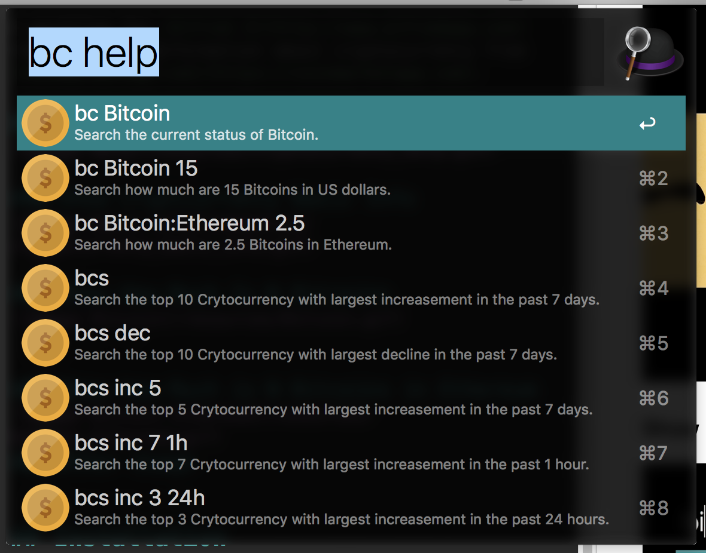

# CryptoCurrency Workflow for [Alfred 3](http://www.alfredapp.com)

A workflow for [Alfred 3](http://www.alfredapp.com) that provides information about cryptocurrency from [coinmarketcap.com](https://coinmarketcap.com).

## Usage Guide

### Show Cryptcurrency Basic Info

### Show How Much Is N Bitcoins

### Show how Much is N Bitcoins in Ethereum

### Other Usage

## Installation
Download the latest version of the `cryptocurrency.alfredworkflow` from [Release](https://github.com/Zhangxi-Lam/alfred-cryptocurrency/releases) and double click the downloaded file to install it.

The workflow supports automatic updates and will perform weekly update checks!

